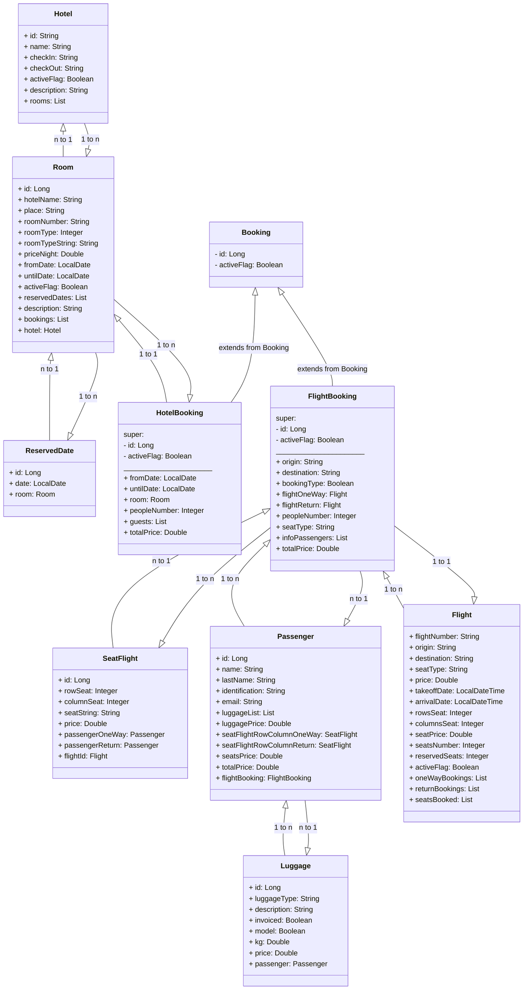
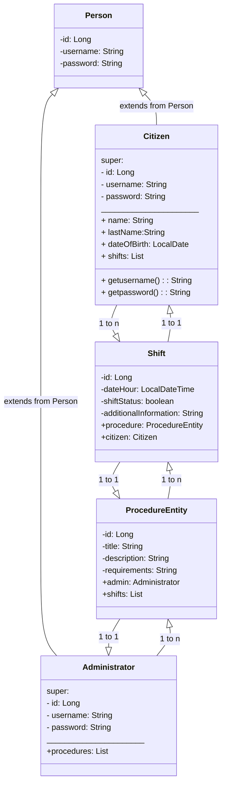
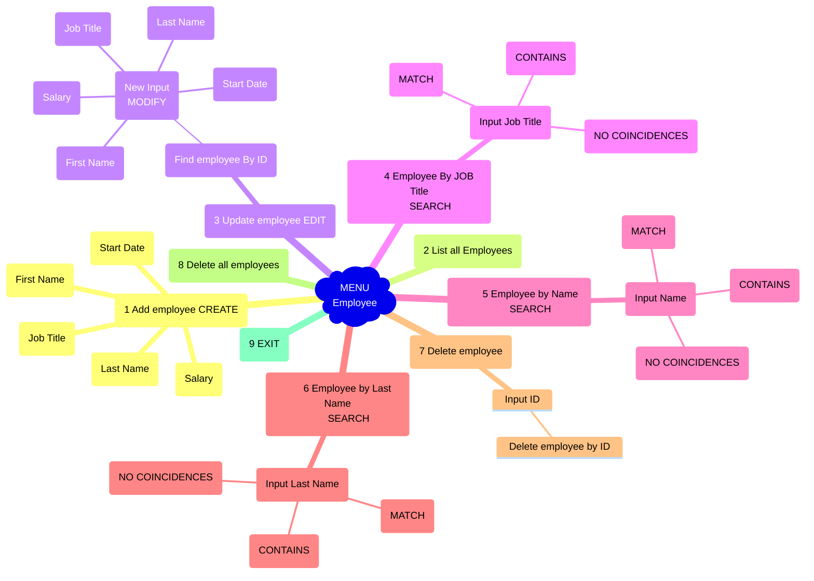

## Hi developers! 👋

Hi I am Andrea a Full-Stack Developer ready to learn more every day and show my growing knowledge.

Tech Stack:

# 📑 Menu

- Projects ✨
  - FULLSTACK MERN: 
    - [Console.log(KATA) ⚡ - MODULE 3](#consolelogkata-) 
    - [COURSE4U 📖 - MODULE 2](#course4u-)
    - [GAME ZOMBIELAND 🧟‍ - MODULE 1](#zombieland-%EF%B8%8F)
  - JAVA + SPRING BOOT:
    - [TRAVEL AGENCY Be_travel 🧳​ ](#travel-agency-be_travel-)
    - [SHIFT-OPERATOR 👩🏻‍💻](#shift-operator-)
    - [EMPLOYEE MANAGEMENT 🤖](#employee-management-)

---
# Big proyects! 🫡 

## Console.log(KATA) ⚡

### 📜 Description

**Important concepts of the app:**

**Katas**: are unresolved javascript functions with pre-instructions to resolve them by returning what the instructions ask for

**Champions**: Games with users, to solve katas, where there is only one winner

This application is called Console.log(KATA) and it is an application to solve katas, such as function puzzles with instructions.

It's fully responsive in all the pages! 🙃

 

https://user-images.githubusercontent.com/116817220/234442234-dd5e3361-d1f9-45bb-b5a6-579601fc9e4c.mp4

### Useful links 🔭

- [Presentation slides](https://slides.com/andrea_0o0_/console-log-kata/fullscreen)
- [Frontend repository](https://github.com/Andrea0o0/Console.log-Frontend)
- [Backend repository](https://github.com/Andrea0o0/Console.log-Backend)
- [Backend deploy](https://kataapp.fly.dev/)
- [Deployed app](https://console-log-kata.netlify.app/)

## COURSE4U 📖

### 📜 Description

**This project has been carried out in partnership with [Monica Camargo](https://github.com/MoniCamargo37)**

COURSE4u is a state-of-the-art online learning platform and it provides users with a comprehensive and dynamic learning experience, offering the ability to browse, explore (search), and subscribe as a premium member for courses, as well as add courses to their Account and leave reviews. Course4u also provides the admin interface that can create new courses, edit current ones, and delete them.

It's fully responsive in all the pages! 🙃

https://user-images.githubusercontent.com/116817220/234450405-f42d01f9-fec3-4211-b056-7031fc5a34b7.mp4

### Useful links 🔭

- [Shared Github Repo](https://github.com/Module-2-Project-COURSE4U/COURSE4U)
- [Github Repo](https://github.com/Andrea0o0/MODULE-2-PROJECT-COURSE4U)
- [Trello kanban](https://github.com/orgs/Module-2-Project-COURSE4U/projects/1/views/1?layout=board)
- [Deployed version](https://course4uu.fly.dev/courses)
- [Presentation slides](https://1drv.ms/p/s!Akm3TPUfj8PLhmOWcd6_o-DQ-JKr?e=zK0Nfy)

## ZOMBIELAND 🧟‍♀️ 

### 📜 Description

This is a game with two avatars to choose from, six worlds, and various opponents depending on the level.

It can be shot, the player has 10 lives and must survive 2 minutes to win.

**[The presentation explains in detail how the game works and the characters, enemies and worlds that exist](https://slides.com/andrea_0o0_/deck/fullscreen)**

### Useful links 🔭

- [Github Repo](https://github.com/Andrea0o0/Zombieland)
- [Presentation slides](https://slides.com/andrea_0o0_/deck/fullscreen)
- [Deployed game](https://andrea0o0.github.io/Zombieland/)

## TRAVEL AGENCY Be_travel 🧳​ 

### 📜 Description

The Be_travel project is a Spring Boot application designed to manage reservations, including flights and hotels, with public routes for reservation creation due to the absence of linked users. It meets strict requirements, such as unique room numbers, accurate hotel descriptions, non-overlapping booked dates, and accurate flight details. Integrated with the MySQL database, it ensures seamless data management and validation for comprehensive travel planning.

### Useful links 🔭

- [Github Repo](https://github.com/Andrea0o0/Andrea0o0-Garcia-Gonzalez-Manchon-Andrea_pruebatec4)
- [Be_Travel Database MySql](https://github.com/Andrea0o0/Andrea0o0-Garcia-Gonzalez-Manchon-Andrea_pruebatec4/tree/main/sql)
- [PostMan](https://github.com/Andrea0o0/Andrea0o0-Garcia-Gonzalez-Manchon-Andrea_pruebatec4/tree/main/postman)

## SHIFT-OPERATOR 👩🏻‍💻

### 📜 Description

This Java-based shift management system efficiently handles shifts and procedures, ensuring strict input validation and MySQL integration. It offers comprehensive functions for shift management, procedure tracking, and user authentication, improving usability for citizens and administrators.

### Useful links 🔭

- [Github Repo](https://github.com/Andrea0o0/Andrea0o0-Garcia-Gonzalez-Manchon-Andrea_pruebatec2)
- [Employee Database MySql](https://github.com/Andrea0o0/Andrea0o0-Garcia-Gonzalez-Manchon-Andrea_pruebatec2/tree/main/mysql)

## EMPLOYEE MANAGEMENT 🤖​ 

### 📜 Description

It is a Java-based system that facilitates employee management, offering CRUD functionality, input validation and an easy-to-use menu-driven interface. It ensures seamless integration with MySQL databases for efficient data manipulation and management.

### Useful links 🔭

- [Github Repo](https://github.com/Andrea0o0/Garcia-Gonzalez-Manchon-Andrea_pruebatec1)
- [Javadoc](https://github.com/Andrea0o0/Garcia-Gonzalez-Manchon-Andrea_pruebatec1/tree/main/src/javadoc)
- [Employee Database MySql](https://github.com/Andrea0o0/Garcia-Gonzalez-Manchon-Andrea_pruebatec1/tree/main/src/mysqlEmployee)

<!--
**Andrea0o0/Andrea0o0** is a ✨ _special_ ✨ repository because its `README.md` (this file) appears on your GitHub profile.

Here are some ideas to get you started:

- 🔭 I’m currently working on my profile
- 🌱 I’m currently learning ...
- 👯 I’m looking to collaborate on ...
- 🤔 I’m looking for help with ...
- 💬 Ask me about ...
- 📫 How to reach me: ...
- 😄 Pronouns: ...
- ⚡ Fun fact: ...
-->
